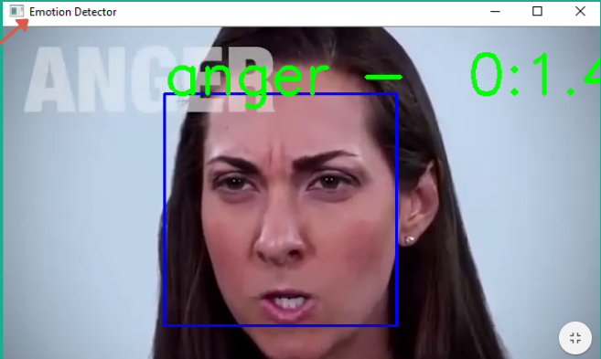
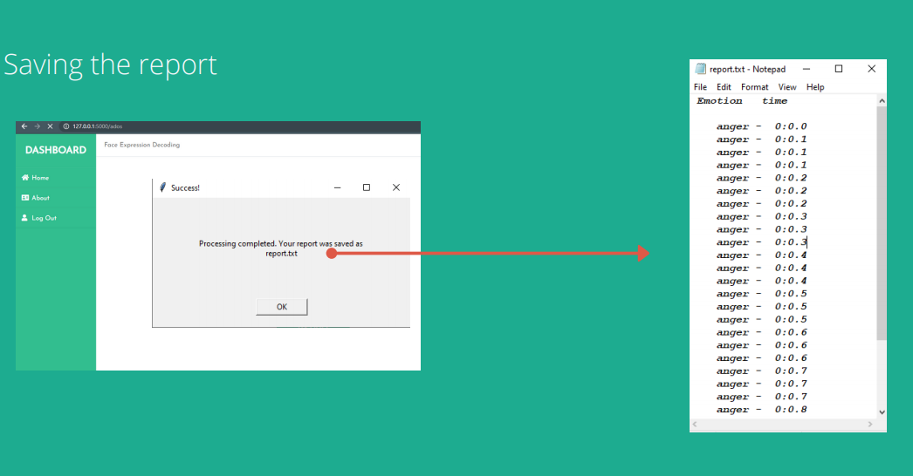
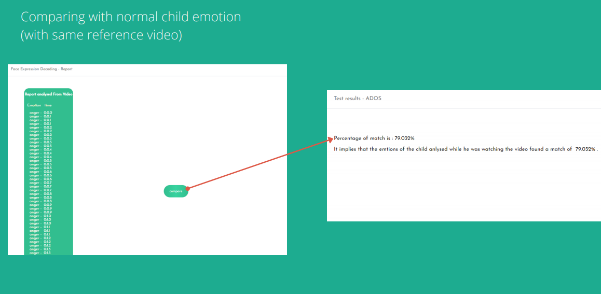

# Emotional_Analysis_For_Autism_Diagnosis
A Tool for implementing Emotion analysis (one category of Observation system using CAR scale )

CHILDHOOD AUTISM RATING SCALE - (CARS) works by rating your child’s behavior, characteristics, and abilities against the expected developmental growth of a typical child.

Here the recored video file of the child is compared with report of normal child and will find the percentage of match. This will help to find the expression comparison of autistic child with normal one.

Type of Reasearch - Deep learning

Dataset -  fer2013 source - https://kaggle.com

Training model - CNN , Transfer Learning - VGG16 , VGG19

Deployment Using Flask

 </img>

 </img>

 </img>
